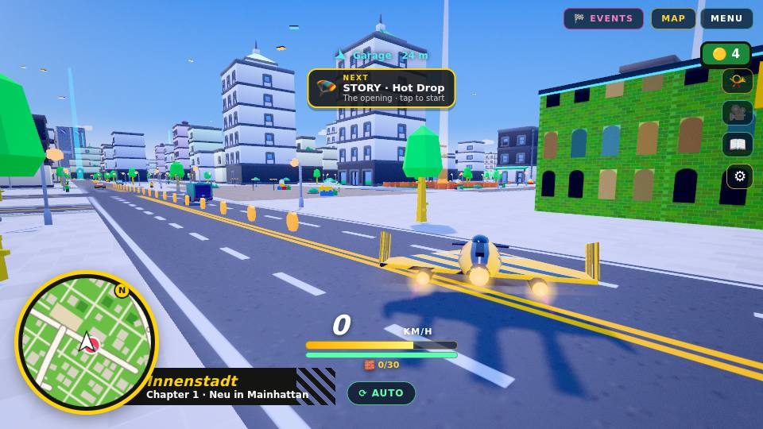
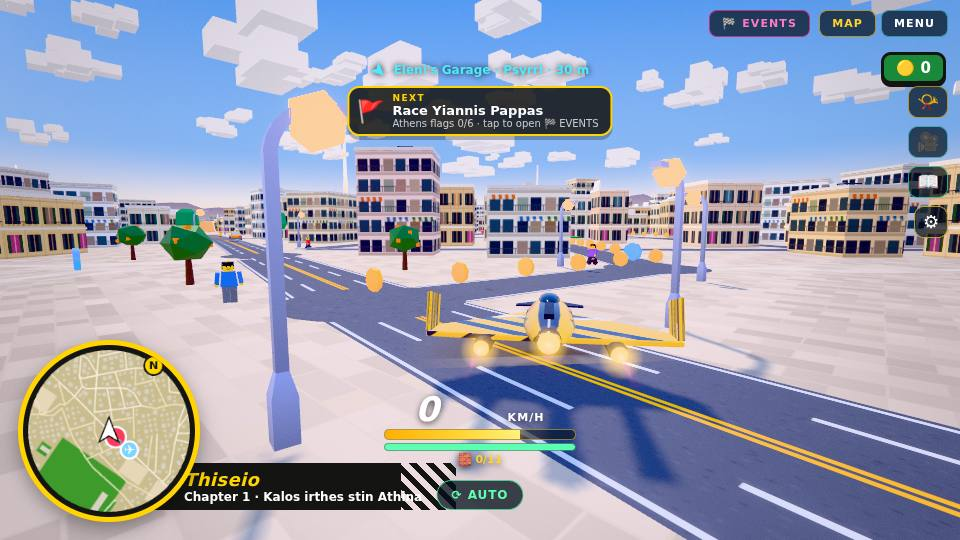
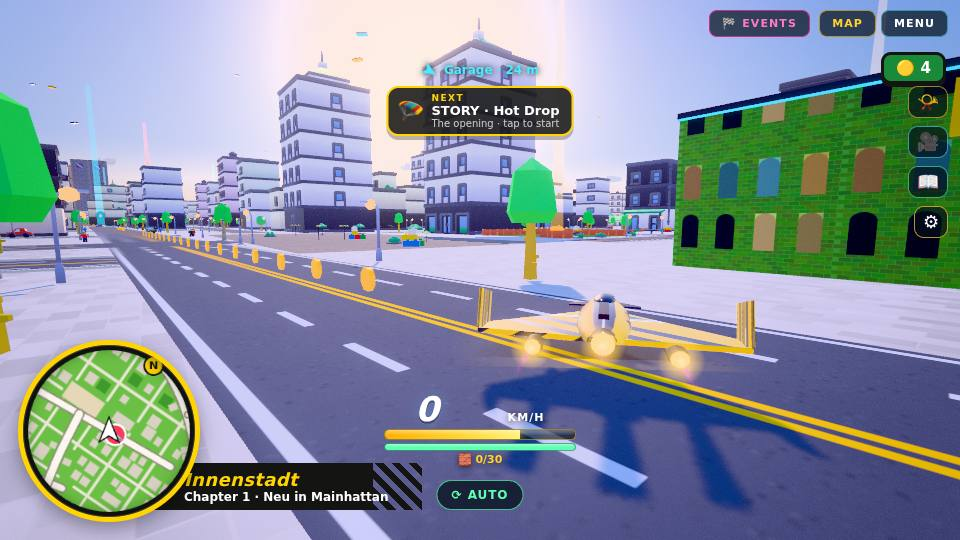
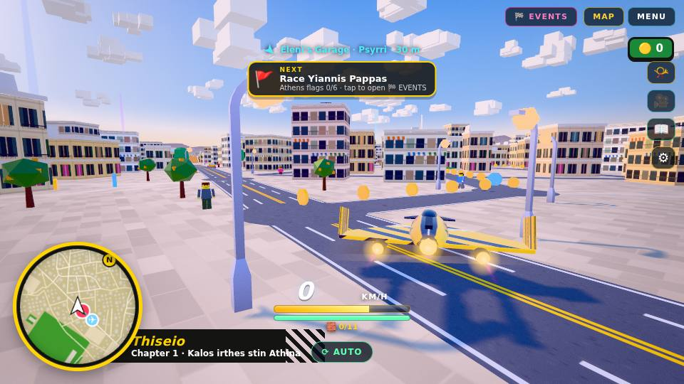
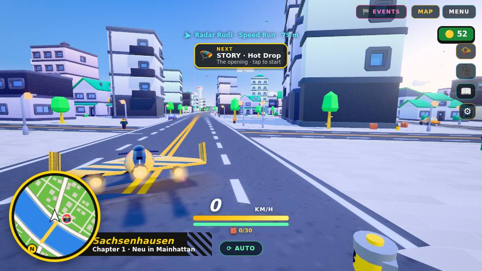
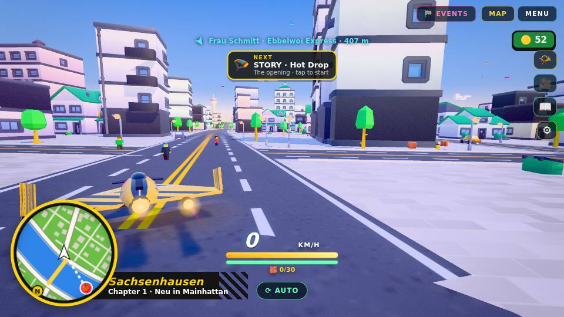
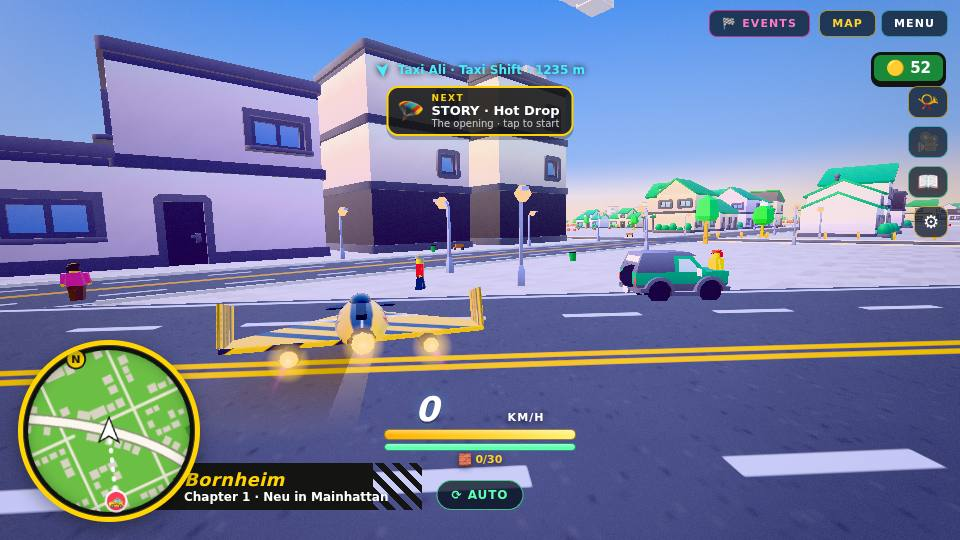

# REPORT · LK (looks + phone performance)

## What changed (all in `lk.js`, inserted by `pLK1.py` at one anchor)
- **Lighting.** The day moods (Frankfurt *Brick Day*, Athens *Attic Sun/Noon*, *Day*) now have a warm key light that sits lower (46° instead of 54°, so shadows are longer), a cool sky fill and a warm ground bounce. Exposure is a little lower so white areas no longer blow out. The sky's sun glow now follows the real light direction, the horizon has a soft warm haze, and in the roam cities the fog colour matches the horizon. On high, the shadow box is ±90 m instead of ±110 m, so shadows are sharper and fewer objects cast them.
- **Materials.** One prototype `onBeforeCompile` hook covers every MeshStandard/Physical material. It adds world-space colour variation (patches of about 30 m plus a fine grain, no texture fetch), caps albedo at 0.8 and adds a sky-tinted fresnel sheen that reads as LEGO plastic. It needs no extra programs per material. On the `min` level it is switched off with a uniform.
- **Water.** HDR sun glints (bloom picks them up) and a stronger fresnel sheen, chained onto the existing `waterMat` shader.
- **Car paint.** The player craft's saturated body colours are glossier (roughness ≤ .34, env ≥ 1.15).
- **Effects.** Sparks are 35% hotter in HDR and add glowing embers. Turbo/boost in roam emits blue twin exhaust flames. Crashes and wrecks add dark smoke, and wrecks also add a fireball. All of this uses the existing fixed-size particle pools, so there are **no new draw calls**.
- **HUD.** CSS polish only: glossy bars, glow on the gauge number, inset shading on the minimap, a gradient on the stud pill. No sizes or positions change.
- **Auto quality.** A frame-time ladder steps high → med → low → min.
  - It steps down when frames average more than 26 ms over 3 s, but only once the dynamic resolution is already at its floor.
  - It steps back up when frames average under 13.5 ms (after 12 s).
  - A steady 30 fps is ignored, because that is the iOS low-power cap, not the GPU struggling.
  - It never goes above the player's own Graphics choice, and the player's choice is what gets saved (`store.set` is wrapped).
  - Per level it sets fog density, camera far (3400/2600/2000/1500 m), shadows, and extra distance culling on low/min (1350/1050 m, small objects 520/420 m), on top of the base `hubCullStep`.

Patch order: `./reapply.sh pLK1.py` → REAPPLY_OK. The page is 3.22 MB (limit 3.6).

## Performance: renderer.info for one full composer frame (all passes), 6 fixed spots per city, before → after
Measured with `node tLK.js <dir> high|med` on a 960×540 desktop viewport. Spots come from the same seeded positions in both builds. Traffic and pedestrians still vary a little between runs (±5% per spot).

**High** (desktop default):

| spot | draw calls | triangles |
|---|---|---|
| Frankfurt 0 | 750 → 765 | 2,323,684 → 2,321,982 |
| Frankfurt 1 | 619 → 727 | 2,249,659 → 2,277,174 |
| Frankfurt 2 | 637 → 676 | 2,141,858 → 2,229,887 |
| Frankfurt 3 | 554 → 547 | 1,848,335 → 1,889,369 |
| Frankfurt 4 | 356 → 351 | 1,419,912 → 1,414,664 |
| Frankfurt 5 | 491 → 367 | 1,492,606 → 1,505,353 |
| Athens A 0 | 286 → 321 | 802,799 → 837,579 |
| Athens A 1 | 234 → 251 | 772,449 → 753,983 |
| Athens A 2 | 234 → 245 | 746,513 → 727,017 |
| Athens A 3 | 239 → 224 | 756,397 → 724,175 |
| Athens A 4 | 230 → 227 | 753,929 → 761,915 |
| Athens A 5 | 148 → 138 | 532,549 → 529,461 |

| average | high before | high after | med before (phone default) | med after |
|---|---|---|---|---|
| Frankfurt calls / tris | 568 / 1,912,676 | 572 / 1,939,738 | 433 / 1,315,309 | 426 / 1,325,721 |
| Athens calls / tris | 229 / 727,439 | 234 / 722,355 | 207 / 548,563 | 207 / 543,696 |

**Result:** there is no draw-call or triangle regression; every difference is within run-to-run noise. A first try with an even lower sun added about 5% triangles to the shadow pass, so I raised the sun to 46° and tightened the shadow box.

**Auto-quality levels** (Frankfurt, same spot, after feeding 40 ms frames):
- high: 366 calls, 1,484,765 triangles, shadows on
- med: 277 calls, 1,012,653 triangles, shadows off
- low: 219 calls, 796,705 triangles, shadows off
- min: 206 calls, 762,784 triangles, shadows off

Going from high to min cuts draw calls by 44% and triangles by 49%. After the drops the saved Graphics setting is still `high`. Feeding fast frames climbs back up low → med → high.

**FX pools:** boost gives fireb 4 particles and a crash gives smoke 4, starting from 0 for both.

**Load time** (boot + enter roam, wall clock in software WebGL, noisy): before 37313 ms → after 34675 ms in Frankfurt. Nothing measurable changed.

## Tests
- `node smoke.js .` → **SMOKE PASS** (12/12, 0 console errors). I looked at `smoke/sheet.png`: nothing is broken on screen.
- `node tLK.js . high after` → 12 spots measured, 4 levels, saved setting kept, recovery works, FX pools fill, 0 errors.

## Screenshots (before → after)
| Frankfurt | Athens |
|---|---|
|  |  |
|  |  |

Frankfurt spot 3:  → . Auto level `low` (no shadows, denser haze, shorter view): 

## Known gaps
- **No real-iPhone measurement.** The levels are driven by frame time and were tested with fed timings, not on a device.
- **Draw calls aren't merged.** Buildings, props and pedestrians belong to the other session, so draw calls only drop through the quality levels and culling.
- **Race-only effects untouched.** Boost flames are roam-only; race boost keeps its existing trail.
- **Faster loading not done.** I made no loading-time change beyond adding no new shader programs.
- **Night and race moods barely change.** Only the sheen and colour variation reach them.
