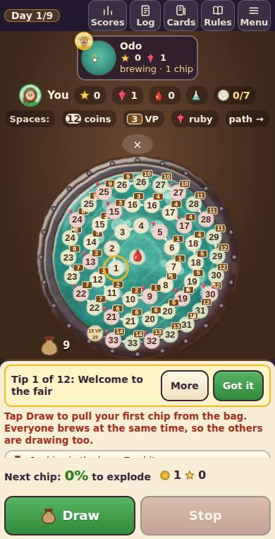
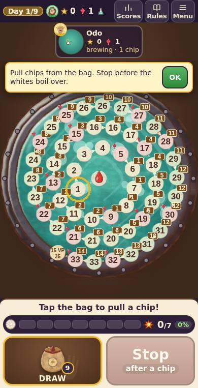
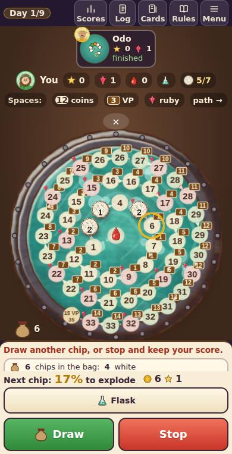
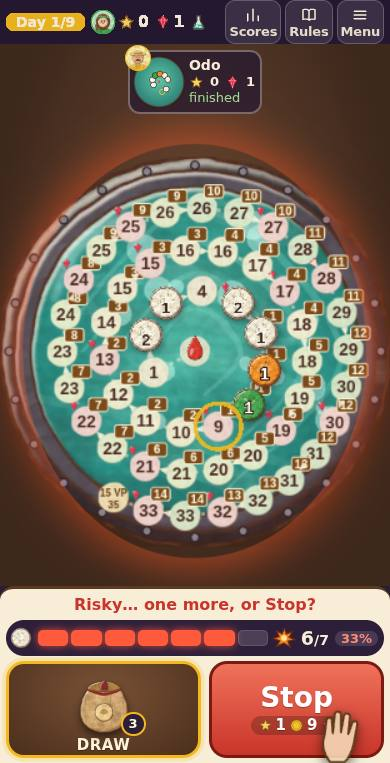
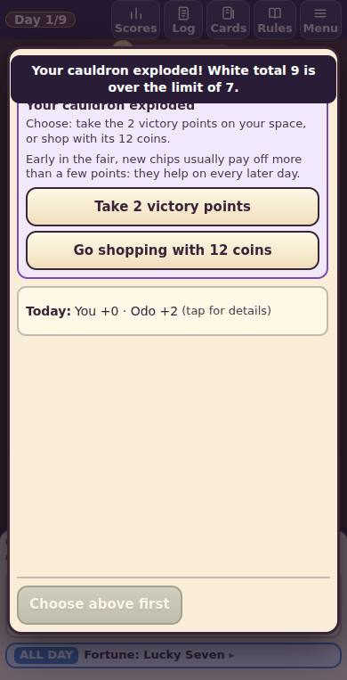
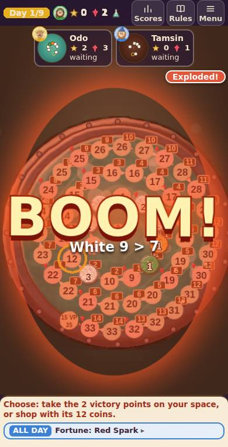
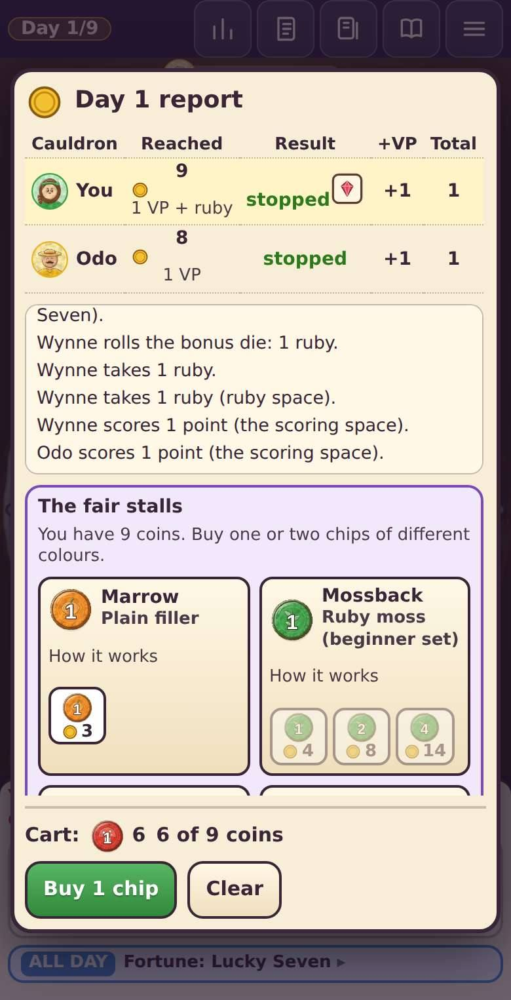
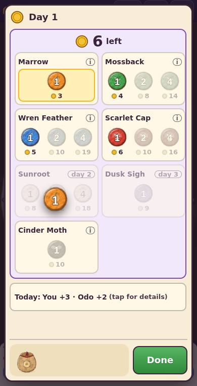

# Cauldron Fair: board-first report (Oct 2026)

Brief: `games-src/clarity-briefs/BOARD-FIRST.md`. Owner's verdict on the clarity build: "completely useless, not like
the game, very confusing". This rework makes the **bag** the hero of the screen and puts the push-your-luck moment at the
centre: pull a chip, watch the white total climb, decide whether to stop.

## Blind testers: not run

The brief asks for three blind phone testers (subagents driving `games-src/scripts/drive-serve.js`) before and after.
In this session, the permission system blocked all three baseline testers on their first driver call. Tester 1's
`curl` to `localhost:9401/open` was denied. Testers 2 and 3 could open the title screen, but their first tap was denied
("Unrequested Commit in a Connected App" / "Exfil Scouting"). Nobody worked around the block. So there are **no tester
numbers, before or after**:

| | Lost moments (after 1st min) | Dead taps | Exciting moment named | Avg fun | Goal in one sentence |
|---|---|---|---|---|---|
| Baseline (clarity build) | not measured (blocked) | — | — | — | — |
| Final (this build) | not measured (blocked) | — | — | — | — |

To run them, allow Bash `curl` calls to `localhost:94xx` for subagents. Then re-run the prompt kept in this session's
scratchpad, or follow the instructions in the brief: 3 testers, 390x763, 390x763 impatient, and 375x553 one-handed.
What was checked instead: scripted touch walk-throughs with real taps (`bf-shot.js`) at 390x763, 375x553 and
1366x768, with every screenshot reviewed by hand, plus the existing automated suites (below).

## What changed (by the brief's checklist)

1. **The board is the screen.** On phones the cauldron fills the middle. The top strip holds the day, your points,
   rubies and flask, plus the rivals' small cauldrons. The "Spaces:" key row, the stat row and the bag-contents text
   panel are gone on phones. Log and Cards moved into the Menu.
2. **Touch the thing itself.** The **bag** is the Draw button: a big painted bag with its chip count, gently glowing
   when it's your move. Stop is the one other big button. It shows what you keep (points and coins). The shop is
   chips on stalls: tap a chip and it flies into a bag drawn at the bottom. Tap it there to take it out, then **Done**,
   and the chips drop into the bag. The explosion choice and the ruby choice are picture tiles (★ +2 points / 🪙 12
   coins to shop; 💎 −2 → 💧 +1 start / flask).
3. **One short line.** A single line above the meter changes with the risk: "Tap the bag to pull a chip!", "Safe!
   Pull another chip", "Risky… one more, or Stop?", "Very risky! Stop now?". Guided tips are one sentence with an OK
   button, with no counters and no "More". A **ghost finger** shows the first bag tap, the first Stop on a risky pot
   (guided game) and the first shop pick. The start-of-day news is a short headline on phones ("✨ Haggler's Hour ·
   🐀 Head start +1").
4. **Cause and effect.** The chip visibly pops out of the bag, hangs for a beat (glowing red if it's white) and flies
   onto its space. The danger meter's new cells pop in one by one and the meter shakes. The pot's glow and bubbles
   rise with the risk. The day report shows one card per maker with the points they earned; the table is under
   "Details".
5. **The fun moment is the centrepiece.** Tap the bag, and a hand rummages in it while the bag wobbles. The pause is
   short when the pot is safe and up to 1.3 s when the next chip may explode it. A tick sound plays on long pulls. A
   second tap hurries the pull and never draws twice. The **danger meter** is a row of cells, one per white point up to
   the limit, with the odds next to it. It goes green, amber, then red, and the 💥 at its end throbs near the limit.
   The **pot** bubbles more and faster as the risk grows, glows red and rumbles near the limit. The **explosion**
   has a full-screen flash, a huge "BOOM!", the reason ("White 9 > 7"), flying shards, a screen quake, a phone
   vibration and a bigger painted smoke burst. The day report waits until the explosion has played.
6. **First game without reading.** The guided game opens on the board with the finger on the bag. After that the
   meter and the line under the bag carry the game.
7. **Portrait first.** 390x763 and 375x553 are both fully playable one-handed: everything you tap sits in the bottom
   third. A compact variant is used on short phones. Desktop and landscape keep the side panel, with the same deck in it.

The rules engine, the AI, online play, hot-seat and saves were not changed. `src/ui6.js` is the new part (the bag,
pull, meter, boil, boom, ghost finger and shop). Small hooks were added in `ui2.js` (the deck), `ui3.js` (events, the
short news), `ui4.js` (report cards, choice tiles, short tips), `ui5.js` (the pull on Draw, menu entries) and
`ui7.js` (the chip launches from the bag after the reveal, bubbles follow the risk, bigger boom).

## Before / after (390x763)

| | Before | After |
|---|---|---|
| Start of the first game |  |  |
| Brewing near the limit |  |  |
| The explosion |  |  |
| The shop |  |  |

## Tests (final build)

- `rules-test.js`: 95 passed, 0 failed. `clarity-test.js`: all passed (76,674 checks, 40 games).
- `click.js 0 12` (jsdom, humans only through the page's buttons): 13 games, 0 errors, 0 stalls, 0 hidden-info
  violations.
- `hidden-test.js 10`, `net-strip-test.js 10`: passed.
- `px-test.js`: PROBLEMS 0 (WebGL high/low/medium, canvas renderer, hot-seat, DOM fallback; chips fly, land and end
  where the engine says).
- `lay-phone.js`: LAYPHONE_RESULT. The test now opens Log and Cards through the Menu on phones, because they left the
  header.
- `bf-shot.js` (new): a real-tap walk-through of two days at any size: `node bf-shot.js 390x763 bf [--vs]`.

## Still open

- No blind-tester numbers (see above). That is the first thing to do once the driver calls are allowed.
- The computer makers still brew in parallel and finish fast. Their small cauldrons update at the top, but you can't
  watch a rival's pull.
- Rare fortune cards (Haggler's Hour, Wren Feather…) still open a text sheet with chip buttons.
