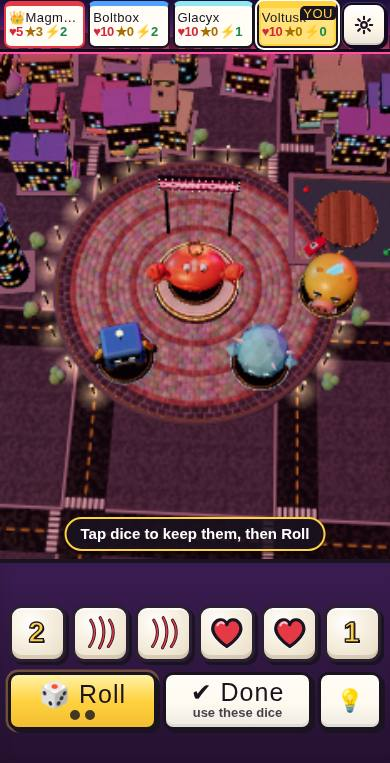
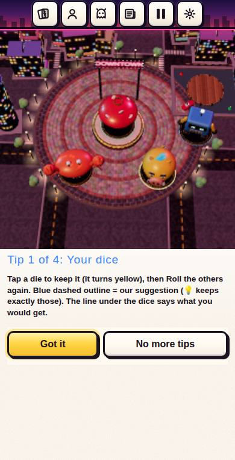
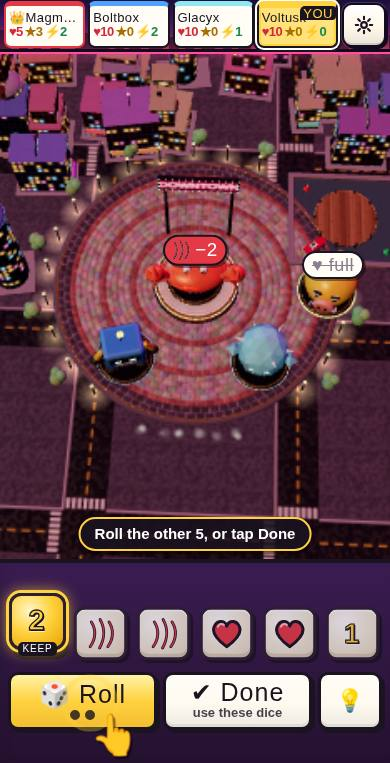
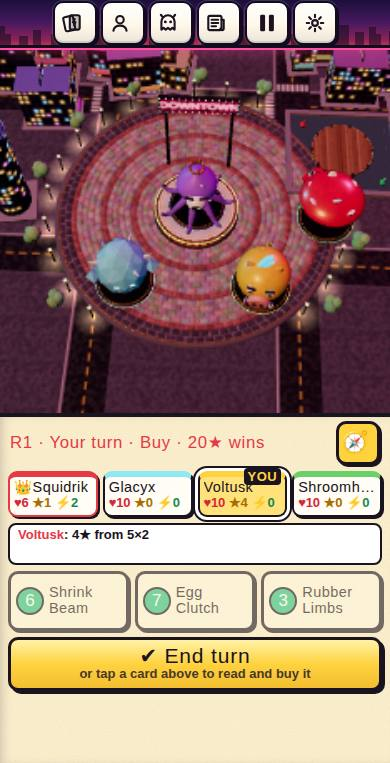
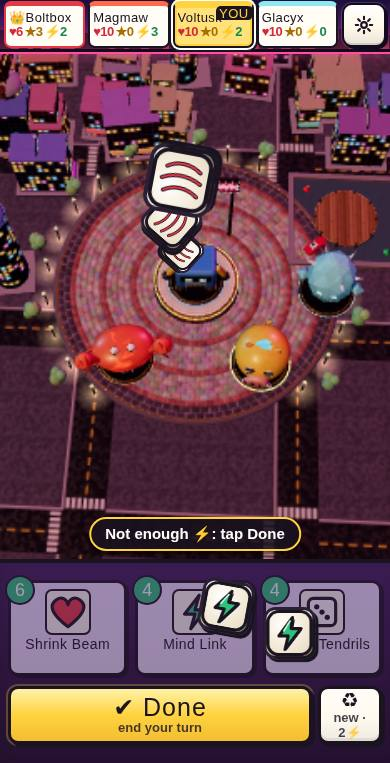
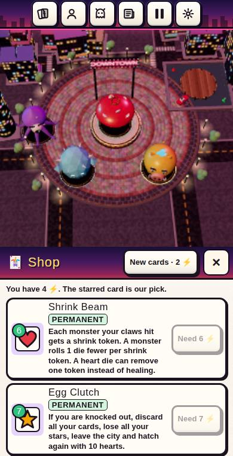
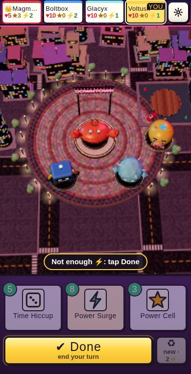

# Crown City Smash: board-first report (Oct 2026)

Preview: `games/crown-city-smash-next/index.html` (https://am015-dev.github.io/spotify_to_ytmusic/crown-city-smash-next/). The live game is unchanged.
Brief: `games-src/clarity-briefs/BOARD-FIRST.md`.

## Tester numbers

Three blind testers per round on a 390x763 phone through `scripts/drive-serve.js`. They read only the first 8 words of any text, decide from the picture, and log lost moments and dead taps. Same three personas every round: a casual board-gamer, an impatient tapper, and a bored teenager.

| Round | Lost after 1st min (each) | Dead taps (each) | Fun (each) | Fun avg | Exciting moment named | Goal in one sentence |
|---|---|---|---|---|---|---|
| Baseline (before) | 2 · 2 · 1 | 3 · 0 · 0 | 3.5 · 3.8 · 4.0 | **3.77** | 3/3 | 3/3 |
| Round 1 | 3 · 3 · 4 | 0 · 4 · 3 | 3.3 · 3.2 · 3.1 | 3.20 | 3/3 | 3/3 |
| Round 2 | 3 · 3 · 3 | 1 · 2 · 2 | 3.4 · 3.0 · 3.3 | 3.23 | 3/3 | 3/3 |
| Round 3 (final) | 3 · 2 · 3 | 0 · 3 · 3 | 3.7 · 3.4 · 2.9 | **3.33** | 3/3 | 3/3 |

**Honest verdict: the acceptance bar is not met.** It asks for at most 2 lost moments each, at most 3 dead taps each, and fun of at least 4.
- Dead taps meet the bar in the final round.
- Lost moments are slightly worse than the baseline.
- Fun is lower than the baseline.

What the testers called exciting (every tester, every round):
- three claws knocking the king out of Downtown;
- five 3s from a reroll;
- a Stay at 2 hearts that won the crown at 20★.

The new board makes the dice moment bigger.

What still drags:
1. **Computer turns.** All 3 final testers complain about waiting through three computer turns in a row. The flights explain what happens, but they also add time. The phone default pace is now faster (one computer step waits 0.32 s instead of 0.65 s), and a tap on the board fast-forwards. This last change was not blind-tested.
2. **Stay / yield.** Testers still guess, and one was knocked out after the recommended "Stay". The prompt is now shorter, the title shows the hearts left ("Stay or yield? ♥4 left"), and the line says "Choose below ↓". It is still a reading decision.
3. **Cards.** With 0–4 energy most cards are out of reach, and the card effects are rules text. The text of the starred card (or the one you tapped) now sits on the board, and buying is: tap a card to see it, tap the card with BUY to buy it.
4. **How numbers score.** For example, "why did four 2s give 3★". The preview badge shows the exact stars before you press Done, and a pair shows "one more 2 → ★". A tester who skims still misses it.

The baseline's own problems were all fixed:
- the shop pop-up hid the affordable card below the fold;
- tips covered the board;
- the "While you waited" text strip;
- nothing to do after a knock-out.

The new ones each round came from the new interaction:
- Round 1:
  - the blue dashed "suggested" outline was read as "kept" (now off on phones; kept dice lift and glow);
  - a two-tap buy felt dead (now the starred card buys in one tap).
- Round 2:
  - hearts in Downtown looked broken (the preview now shows them crossed out);
  - a grey Roll after the last roll was a dead tap (Roll now goes away).

Per-tester logs are in the session scratchpad and are summarised here. Each round's changes are in the git history of `kot/board.js`.

## What changed (portrait phone; landscape keeps its rail with the same board effects)

- **The board is the screen.**
  - The monster chips became the thin score strip in the top bar (♥ ★ ⚡ per monster, YOU marked). Only the ⚙ menu stays up there; Cards / Yours / Monsters / Log moved into it.
  - The city now takes about 507 px of 763, up from about 365.
  - The tray at the bottom holds only the dice and Roll / Done, or the three shop cards and Done.
- **One line** on the board, at most 8 words (enforced by a test), e.g.:
  - "Tap dice to keep them, then Roll"
  - "No rolls left: tap Done"
  - "Magmaw's turn · tap to speed up"
  - "Magmaw hits you −3♥"
  - "Glacyx is close to 20★!"
- **The dice are the centrepiece.**
  - Big dice (57 px). A kept die lifts and glows gold.
  - Roll throws the free dice up: they tumble face-hidden and land one by one with a clack each.
  - Before you press Done, the board shows what the dice would do:
    - a red claw badge "−2" on every monster your claws would hit;
    - +♥ +⚡ +★ over you;
    - "👑 +1★" on an empty Downtown;
    - crossed-out hearts in Downtown;
    - "one more 3 → ★" for a pair.
- **Cause and effect on the board.** When the dice resolve, the dice themselves fly:
  - claws smash into each monster they hit (shake, burst, −N);
  - hearts fly into you;
  - energy and number dice fly into your score chip, whose number changes only when they land.
  - Computer turns do the same, and the computer waits for the dice to land.
  - Any other gain, such as Downtown's +2★ at the start of a turn, flies from the monster to its chip.
- **The shop is tapping cards in the market.**
  - Three cards in the tray: cost, art and name. The affordable ones have a green rim.
  - The starred card (our pick) shows BUY and its text on the board: one tap buys it, and it flies to your chip.
  - Tapping another card shows it; a second tap buys it.
  - A card you can't afford shakes and the line says why ("Need 5 ⚡").
- **First game without reading.**
  - The opening card is just "You are VOLTUSK · First to 20★ wins · ▶ Let's smash".
  - A ghost finger then shows each new move once: keep a die, Roll, Done, buy.
  - The four text tips no longer appear on phones.
- **Small things:**
  - Knocked out in a solo game: the rest plays fast and a New game button appears.
  - A rival at 15★ or more pulses red.
  - Tapping the board on your turn says "Tap the dice below ↓".
  - The two prompts testers stumbled on are reworded: "Sell a card for ⚡?" (Shed Skin), and the Stay/yield options.

The rules engine and the computer players are unchanged. The only engine edits are prompt wording (titles and labels of the Shed Skin and Stay/yield questions). Everything else is the new phone layer: `kot/board.js`, `kot/board.css` and the phone sizes in `kot/phboot.js`.

## Before / after (390x763)

| | Before | After |
|---|---|---|
| Your roll |  |  |
| Keep + preview |  |  |
| Dice resolve |  |  |
| Buy step |  |  |

## Tests

| Test | What it covers | Result on the final build |
|---|---|---|
| `kot/board-test.js` (new) | score strip in the bar, menu rows, shop tap-to-see / tap-to-buy, unaffordable never buys and says why, ≤ 8-word line in a whole played game, knocked-out fast-forward + New game | 14/14 |
| `kot/lay-phone.js` (updated for the board-first portrait: menu instead of bar buttons, shop in the tray, no 🧭 in portrait) | real WebGL + touch at 390x763, 375x553, 390x844, 844x390: no scroll, board size, tap targets ≥ 44 px (dice ≥ 52), text ≥ 13 px, nothing clipped | see the last section |
| `kot/click-phone.js` | 8 whole games through the phone controls | see the last section |
| `kot/clarity-test.js` | earlier clarity regressions | see the last section |
| `scripts/nettest.js` | online play: host + 2 clients | see the last section |
| `scripts/rulestest.js` | rules | see the last section |
